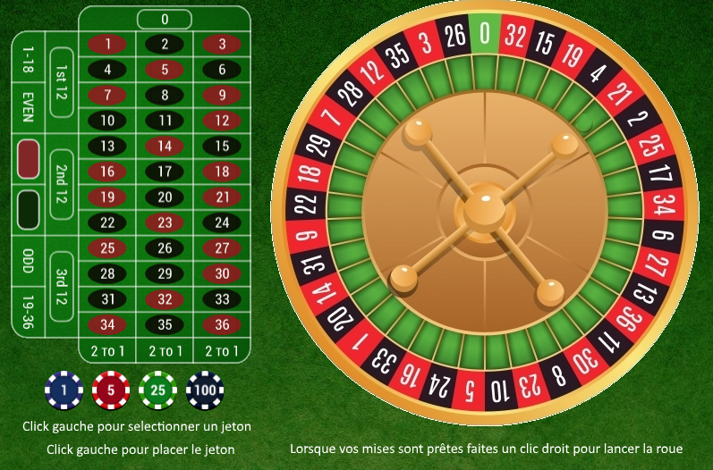
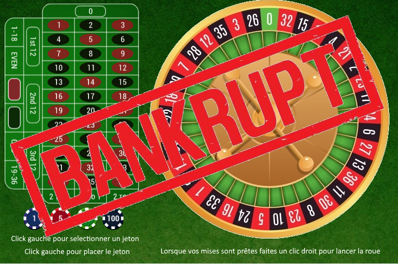

# Vegas Roulette Game


<br />

# Prerequisites

The Vegas roulette game is coded in C++ and requires to install first the `Imagine++` library.

# Betting phase

After clicking on the lauching screen, the main interface is displayed with the different elements:
- the roulette wheel
- the betting mat
- the chip values



<br />

The player starts with 100 chips.

```sh
Vous disposez de 100 euros
```

The player can bet by left clicking on chips and then left clicking on the betting case of his choice.


<br />

```sh
Vous avez selectionne un jeton de valeur 5 euros
Vous avez mise 5 euros sur 20
Vous avez selectionne un jeton de valeur 25 euros
Vous avez mise 25 euros sur rouge
```

# Gambling phase

By right clicking anywhere, the betting phase ends and the roulette wheel starts: Rien ne va plus! <br />
Depending on the (perfectly random) result, the player wins or loses his bets.

```sh
Rien ne va plus
Le numero gagnant est le 16 rouge
Vous avez gagne 20 euros
Vous disposez de 120 euros
```

A new betting phase is then initiated if the player has money, otherwise the game ends

```sh
Rien ne va plus
Le numero gagnant est le 21 rouge
Vous avez perdu 3 euros
Bankrupt
```


